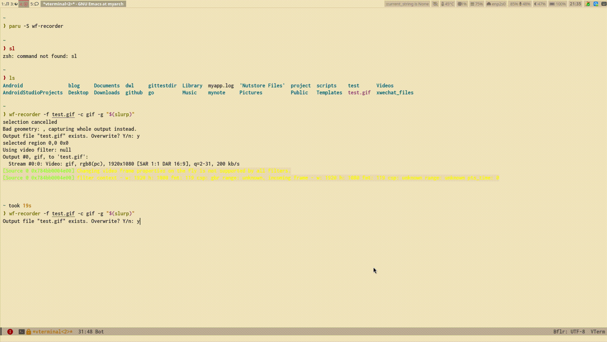

# waybar-line-show

想在这个waybar 准备一个地方 专门显示一些有意思的东西


在运行的时候，在其他地方使用

``` shell
busctl --user call org.zbus.MyGreeter /org/zbus/MyGreeter org.zbus.MyGreeter1 SendWord s hello 
```
就可以与之交互

目前实现的翻译


需要使用这个字典 ecdict.csv 进行查词
在waybar的config
添加

``` shell
    "custom/line-show":{
        "format": "{}",
        "exec":"~/.config/waybar/waybar-line-show"
    }
```

想实现的功能
- [] 显示歌词
- [] 显示翻译句子
- [] 显示一些有意思的ascii单行动画
